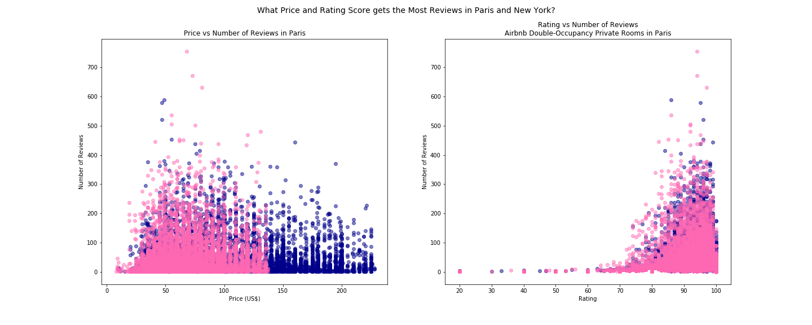

# Airbnb vs Hotel - what is the better lodging option?

We chose to compare and contrast Airbnb versus hotel lodging choices in the eight major cities listed below. Airbnb listing data was captured for each city on the date indicated:
* Amsterdam (March 7, 2019)
* Beijing (February 11, 2019)
* Las Vegas (February 13, 2019)
* Los Angeles (March 6, 2019)
* Madrid (March 8, 2019)
* New York (March 6, 2019)
* Paris (February 5, 2019)
* Sydney (March 7, 2019)

These cities were chosen subjectively, influenced by a desire to include well-known pleasure destinations worldwide, to have representation outside the US, and for availability of data. 

Airbnb data was obtained from the website Inside Airbnb (http://insideairbnb.com/get-the-data.html ). Hotel data was downloaded from a 2016 free World Hotel dataset from Lucas Monteiro on Github (https://github.com/lucasmonteiro001/free-world-hotel-database/blob/master/hotels.csv.zip) for some analysis and geographic comparison. Further hotel data was scraped from TripAdvisor (https://www.tripadvisor.com) on March 28, 2019.

For more details, images, and further exploration of the data, please see the following notebooks:

* airbnb/AirBnBnotebook.ipynb
* airbnb/Airbnb-Qualitative.ipynb
* hotel-tripadvisor/hotelScraped.ipynb
* Hotels_Analysis/Hotels.ipynb

## What is the better lodging option, Airbnb or hotel? 

We compared average price and guest rating for each type of lodging in each city, based on non-shared, double-occupancy accommodations. In each city except Beijing, the average Airbnb price was lower than the average hotel price. In Beijing, however, the average Airbnb price was significantly higher, as seen below:

We also compared average ratings for these lodgings, and found Airbnb ratings to be higher than hotel ratings in each city, as seen below:

## Analysis

Judging from price and rating scores, Airbnb appears to be the better choice for lodging in most cities. In all eight, Airbnb average ratings are higher than ratings for hotels, but we view the ratings comparison warily for two reasons:
* This hotel data set used a 5-star rating system, which we converted to a 100-point scale. The smallest increment of difference was a half star, which means there were no values between 10-point increments in the converted rating.
* Airbnb hosts and guests rely on reviews to rent properties. Hosts and guests review each other, and our team members have personally experienced incentives being given to give high reviews
Since all city Airbnb ratings are high and close together, we look to the hotel rating data to make a tentative hypothesis that lodgers are most happy in Paris and Amsterdam, and least happy in LA.

Regarding price, Airbnb accommodations were cheaper on average in all world cities except for Beijing. Staying at a hotel appears to be the much better choice economically in Beijing. We do not know the factors influencing this, but have guessed Airbnb lodgings may not be as popular, culturally accepted, or readily available in Beijing as in other world cities.

Our initial expectation was that we would find Airbnb lodgings to be cheaper than hotels everywhere. When statistically comparing hotel and Airbnb prices in each city, we were surprised to find that these prices are close enough to be considered the same in Sydney, where the t-test gave a p-value of  0.12162849337212868. All other t-tests showed hotel and Airbnb prices to be significantly different on average per city. P-values were as follows:
* Amsterdam: 9.591664032389106e-25
* Beijing: 1.9542924501970783e-13
* Las Vegas: 2.54877892420858e-09
* Los Angeles: 4.3507089477750976e-33
* Madrid: 1.1092522539374785e-05
* New York: 6.001234505656201e-42
* Paris: 2.504130988008925e-40
* **Sydney: 0.12162849337212868**

Lodging price distributions for each city, excluding outliers, are shown below with mean price lines in red for Airbnb, and black for hotels.

----

## How do lodging options vary city to city? 

In addition to price and rating differences discussed above, we found an unexpected Airbnb listing density difference between cities. The square areas of these cities vary widely, so we checked the raw listing count (before filtering) for each city against its geographical area, and found the density in Paris to be extremely high as shown in the chart below.

## Analysis

As mentioned above, lodging prices vary significantly from city to city, as shown by one-way a ANOVA comparing Airbnb prices for all eight cities (statistic=1975.0873644553315, pvalue=0.0), and a one-way ANOVA comparing hotel prices for all eight cities (statistic=68.52842096834225, pvalue=1.0113350127400278e-93). We were unable to obtain exhaustive hotel listing information, but considering Airbnb data, there appears to be considerable difference in choice based on the density of available listings.

----

## How does lodging vary within a city, neighborhood to neighborhood?

Using the hotel geography we had, plotting heat maps showed hotels tending to cluster centrally, as shown in the New York City hotel heat map below.

By comparison, Airbnb clusters appear in more varied locations, as shown in the Airbnb heat map of New York below.

## Analysis

Though our data set for hotels was limited, the New York City heatmap indicates hotel accommodations are concentrated mainly in midtown. By contrast, the New York City heatmap for Airbnb listings shows a more continuous spread throughout the boroughs. Both heatmaps are weighted for price, and it is interesting to see that while central (Manhattan) locations show  higher price, hip neighborhoods such as Williamsburg and Greenpoint show strong with price concentrations that suggest desirability, though they are not as central. High concentrations in outlying areas may indicate these neighborhoods have arrived as destinations in and of themselves.

In general, we found that many cities show the highest prices for lodging in the most central neighborhoods, with prices decreasing toward the outer reaches. This can be seen in the Madrid chloropleth showing average neighborhood Airbnb prices below.

----

## Where do people choose to stay - what factors affect this?

We used number of reviews as a marker to indicate the most popular lodging choices in both hotel and Airbnb datasets, and created scatter plots to look for patterns. Plotting number of reviews against price and rating, we observed a "middle value" (neither best nor worst price and rating) where there were the most reviews. A plot of hotel data is shown below.

A comparable plot using Airbnb data for New York (blue) and Paris (pink):

## Analysis

The scatter plots indicate a concentration at of low-moderate price and high rating where the most reviews are logged. The AirBnBnotebook file in the airbnb directory contains a scatter plot indicating a specific listing description word count range that coincides with the most reviews. Lodgers appear most attracted to moderately-priced accommodations with high ratings and ample description about the property.

----

## Finally, where should you stay?

Using lower prices, higher ratings, and wider neighborhood location choice as reasons, this analysis would recommend Airbnb lodgings over hotel accommodations for most of the cities. However it is interesting to note that the Airbnb data used here was provided by a website that is essentially against the continued proliferation of Airbnb rentals in cities worldwide.  The site owner provides the data hoping it will be used in conjunction with other information to show how the growth of Airbnb has had detrimental effects on cities.

We did not have the opportunity to obtain other kinds of data to measure the qualitative impact of Airbnb on these destinations, but it is difficult to ignore consistent items in the news that place Airbnb in a negative light. As a final gesture to acknowledge these associations, we used the Google Custom Search API in conjunction with 12 major news websites to create a word cloud based on news headlines returned from the search term "airbnb". This result is below.

